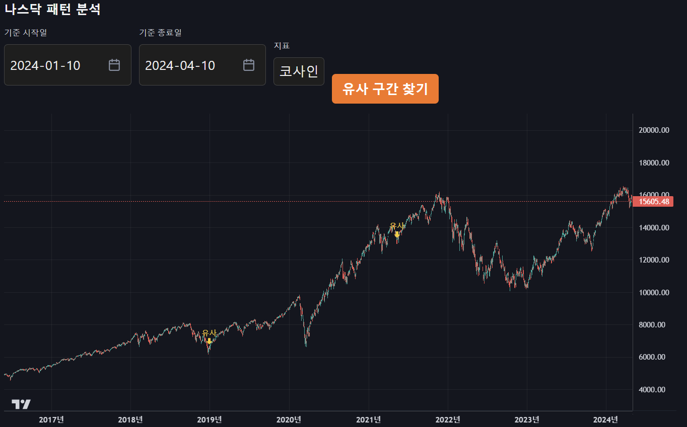
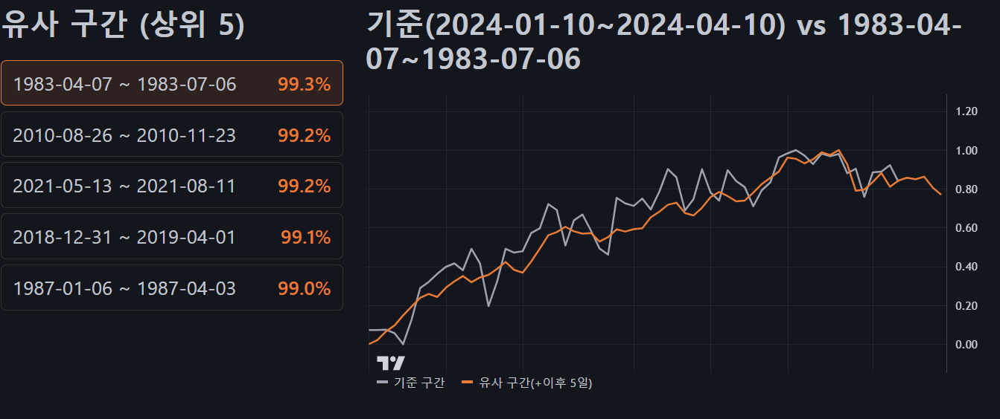

# 나스닥 패턴 분석 차트

나스닥 종합지수의 과거 데이터(1980~2024년, 일봉)를 캔들차트로 보여주고,
특정 기간의 주가 흐름과 가장 비슷하게 움직였던 과거 구간을 찾아보는 프로젝트입니다.
"지금과 닮은 흐름이 과거에도 있었다면 그 뒤엔 어떻게 됐을까?"라는 질문을
코사인·피어슨 유사도로 따져보는 것을 목표로 합니다.

**라이브 데모: https://database-nasdaq-dyb7.vercel.app**

## 화면




## 주요 기능

- **과거 데이터 캔들차트** — 1980~2024년 나스닥 종합지수 일봉 약 11,000개를 캔들스틱으로 표시
- **유사 패턴 분석** — 기준 구간(시작일·종료일)과 유사도 지표(코사인/피어슨)를 고르면,
  그 구간과 가장 비슷하게 움직였던 과거 구간을 찾아
  메인 차트에 마커로 표시하고, 두 구간을 정규화해 겹친 비교 차트로 "그 뒤 흐름"까지 보여줍니다.

## 기술 스택

- **프론트엔드** — React, lightweight-charts
- **백엔드** — FastAPI, SQLite, numpy
- **배포** — Vercel

## 구성

- `front/` — 캔들차트와 유사 패턴 분석 UI
- `back/` — API(`main.py`), 유사도 계산(`analysis.py`), 데이터 적재·분석 스크립트
- `api/` — Vercel 서버리스 배포용 백엔드 진입점

프론트와 백엔드는 각각 별도의 Vercel 프로젝트로 배포합니다.

## 실행 방법

### 백엔드

```bash
cd back
pip install -r requirements.txt
uvicorn main:app --reload          # http://127.0.0.1:8000
```

CSV에서 데이터베이스를 다시 만들고 싶다면:

```bash
python database.py     # CSV → chart.db 의 stocks 테이블 적재
python cosine.py       # 코사인 유사도 계산 후 저장
```

### 프론트엔드

```bash
cd front
npm install
npm start              # http://localhost:3000
```

로컬에서는 `REACT_APP_API_URL`을 비워두면 자동으로 `http://127.0.0.1:8000`을 사용합니다.

## API

- `GET /nasdaq_chart` — 일봉 OHLC 데이터
- `GET /similar_patterns?start=&end=&metric=&top=` — 기준 구간과 유사한 과거 구간을 즉석에서 계산
  (`start`·`end`는 `YYYY-MM-DD`, `metric`은 `cosine`/`pearson`, `top`은 개수)
- `GET /cosine_similarity` — 미리 계산해 둔 유사 구간 목록(초기 버전)

배포 환경에서는 `/api` 접두사가 붙습니다 (예: `/api/nasdaq_chart`).

## 성능 최적화

배포하고 나니 차트 페이지가 눈에 띄게 느렸습니다. 처음엔 백엔드 탓인 줄 알았는데,
하나씩 재보니 병목은 두 군데였습니다. 응답을 압축 없이 통째로 내려보내던 API와,
1만 개가 넘는 캔들을 한 번에 그리던 차트입니다.

**응답이 1.99MB였습니다.** 
`/nasdaq_chart`는 일봉 11,125행을 한 번에 내려주는데,
응답을 보니 압축이 꺼져 있었습니다. JSON은 컬럼명이 행마다 반복돼서 압축이 잘 먹는데도요.
FastAPI에 gzip 미들웨어 한 줄을 더하니 263KB로 약 7.5배 작아졌습니다.
안 쓰는 필드를 빼거나 데이터를 잘라 보내는 방법도 있었지만, 차트가 전체 기간을 보여줘야 해서
데이터 자체를 줄일 순 없었습니다. 압축은 코드 한 줄로 응답 구조를 그대로 둔 채 효과를 내서
프론트를 손댈 필요가 없었고, 그래서 가장 적은 변경으로 가장 큰 효과를 내는 이 방법을 택했습니다.

**매 요청마다 함수가 새로 떴습니다.** 
응답 헤더가 `max-age=0`이라 요청이 올 때마다
서버리스 함수가 콜드스타트하고 SQLite를 다시 읽었습니다. 이 데이터는 한 번 만들어지면
바뀌지 않으니, `Cache-Control`에 긴 `s-maxage`를 줘서 엣지가 대신 응답하게 했습니다.
배포할 때마다 Vercel이 캐시를 비워주기 때문에 오래된 데이터가 남을 걱정도 없습니다.
데이터를 아예 정적 파일로 빼면 더 빠르지만 API의 유연함을 잃고, 함수 안에 메모리 캐시를 두면
웜 호출만 빨라질 뿐 함수 호출 자체는 못 줄입니다. 그 사이에서 둘의 장점을 같이 가져가는
엣지 캐싱을 골랐습니다. 압축과 캐싱을 더한 뒤 응답 시간은 약 2초에서 0.15~0.49초로 줄었습니다.

**진짜 병목은 차트였습니다.** 
여기까지 하고도 느려서 다시 재보니, 백엔드는 이미 빨랐고(0.15~0.49초)
느린 건 11,125개 캔들을 그리는 프론트였습니다. 차트는 처음엔 익숙한 ApexCharts로 빠르게
띄웠는데, 데이터가 이만큼 늘면서 한계가 드러났습니다. ApexCharts는 캔들마다 SVG 요소를 만드는데
보통 1~2천 개를 넘으면 버거워합니다. 설정을 손본다고 될 문제가 아니라 구조적 한계였습니다.
애니메이션을 끄고 데이터를 주·월 단위로 줄이면 ApexCharts로도 빨라지지만, 그러면 일봉 패턴 차트를 선택한 의미가 없다고 생각했었습니다. 이 프로젝트는 일봉 패턴을 비교하는 게 핵심이라 상세도를 포기할 수 없었습니다.
그래서 canvas에 한 번에 그리는 lightweight-charts로 갈아탔습니다. 금융 차트에 특화돼 있고
무료이면서 1만 개가 넘는 캔들도 부드럽게 다룹니다. 덤으로 무거운 apexcharts가 빠지면서
JS 번들(gzip)도 183KB에서 99KB로 줄어 첫 로딩까지 빨라졌습니다.

| 영역 | 한 일 | 결과 |
|------|------|------|
| API 응답 크기 | gzip 압축 | 1.99MB → 263KB |
| API 응답 시간 | 압축 + 엣지 캐싱 | 약 2초 → 0.15~0.49초 |
| 차트 렌더 | ApexCharts → lightweight-charts | 11,125개 캔들도 부드럽게 |
| JS 번들 | apexcharts 제거 | gzip 183KB → 99KB |

크기와 시간은 `curl`로, 번들 크기는 CRA 빌드 출력으로 쟀습니다. 직접 확인해보려면 아래의 명령어로 확인하면 됩니다.

```bash
# gzip 압축 전후 크기 (1989350 → 263033)
curl -s -o /dev/null -w "%{size_download}\n" \
  https://database-nasdaq.vercel.app/api/nasdaq_chart
curl -s -H "Accept-Encoding: gzip" -o /dev/null -w "%{size_download}\n" \
  https://database-nasdaq.vercel.app/api/nasdaq_chart

# 엣지 캐시 적중 (같은 요청을 두 번째 보내면 HIT)
curl -s -D - -o /dev/null \
  https://database-nasdaq.vercel.app/api/nasdaq_chart | grep -i x-vercel-cache
```

차트 렌더 속도는 따로 수치를 재진 않았고, 체감과 라이브러리 특성에 근거한 설명입니다.

## 데이터

나스닥 종합지수 일봉(1980~2024년) CSV를 `back/`에 두고, `database.py`로
SQLite(`chart.db`)의 `stocks` 테이블에 적재해 사용합니다.

| 컬럼 | 의미 |
|------|------|
| `date` | 날짜 |
| `stock_market_price` | 시가 |
| `stock_high_price` | 고가 |
| `stock_low_price` | 저가 |
| `stock_closing_price` | 종가 |
| `volume` | 거래량 |
| `change` | 변동률 |
