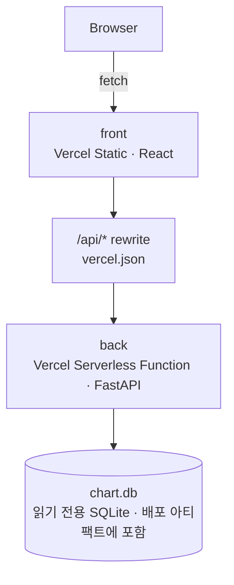

# 나스닥 패턴 분석 차트

    

나스닥 종합지수의 과거 데이터(1980~2024년, 일봉)를 캔들차트로 보여주고,
특정 기간의 주가 흐름과 가장 비슷하게 움직였던 과거 구간을 찾아보는 프로젝트입니다.
"지금과 닮은 흐름이 과거에도 있었다면 그 뒤엔 어떻게 됐을까?"라는 질문을
코사인·피어슨 유사도로 따져보는 것을 목표로 합니다.

**라이브 데모: https://database-nasdaq-dyb7.vercel.app**

## 목차

- [나스닥 패턴 분석 차트](#나스닥-패턴-분석-차트)
  - [목차](#목차)
  - [화면](#화면)
  - [주요 기능](#주요-기능)
  - [유사 패턴은 어떻게 찾나](#유사-패턴은-어떻게-찾나)
  - [기술 스택](#기술-스택)
  - [아키텍처](#아키텍처)
  - [구성](#구성)
  - [사전 요구사항](#사전-요구사항)
  - [실행 방법](#실행-방법)
    - [백엔드](#백엔드)
    - [프론트엔드](#프론트엔드)
  - [환경 변수](#환경-변수)
  - [API](#api)
    - [`GET /nasdaq_chart`](#get-nasdaq_chart)
    - [`GET /similar_patterns`](#get-similar_patterns)
  - [성능 최적화](#성능-최적화)
  - [데이터](#데이터)
  - [면책 조항](#면책-조항)
  - [라이선스](#라이선스)

## 화면


## 주요 기능

- **과거 데이터 캔들차트** — 1980~2024년 나스닥 종합지수 일봉 약 11,000개를 캔들스틱으로 표시
- **유사 패턴 분석** — 기준 구간(시작일·종료일)과 유사도 지표(코사인/피어슨)를 고르면,
  그 구간과 가장 비슷하게 움직였던 과거 구간을 찾아
  메인 차트에 마커로 표시하고, 두 구간을 정규화해 겹친 비교 차트로 "그 뒤 흐름"까지 보여줍니다.
  (기준 구간 날짜는 데이터가 있는 범위로만 선택할 수 있습니다.)

## 유사 패턴은 어떻게 찾나

기준 구간을 고르면, 전체 기간에서 같은 길이의 과거 구간들과 비교해 가장 비슷하게 움직인
구간을 찾습니다. (`back/analysis.py`)

1. **슬라이딩 윈도우** — 기준 구간 길이가 거래일 L개라면, 전체 종가 시계열(약 11,125일)을
   하루씩 밀며 같은 길이 L의 과거 후보 구간을 전부 만듭니다 (약 11,000개).
2. **정규화** — 지표에 따라 다르게 처리합니다.
   - `cosine`: 기준 구간과 각 후보 구간을 각각 자기 자신의 최소·최대값으로 `[0, 1]` 정규화한 뒤
     코사인 유사도를 구합니다. 정규화 없이 원본 가격으로 코사인을 구하면 모든 벡터가 "같은
     방향"이라 유사도가 항상 0.99 근처로 나오기 때문에, 구간별로 정규화해 절대 가격이 아닌
     구간 내 모양을 비교합니다.
   - `pearson`: 평균을 뺀(demean) 값끼리 내적/노름 비율을 구합니다. 이는 표준 피어슨
     상관계수와 동일한 계산이며, 상관계수 자체가 스케일·오프셋 변화에 불변이라 별도
     정규화가 필요 없습니다.
3. **유사도 계산** — numpy 행렬곱(`windows @ base`)으로 후보 전체를 한 번에 비교합니다.
   후보 수 N, 구간 길이 L에 대해 O(N×L)이지만 벡터화된 연산이라 체감 지연은 작습니다.
   (개발 환경 기준, 40거래일 구간은 약 14ms, 355거래일 구간은 약 78ms — 데이터가 이미
   메모리에 올라온 warm 상태.)
4. **중복 제거** — 유사도가 높은 순서로 순회하면서 기준 구간과 겹치거나 이미 선택된 구간과
   겹치는 후보는 건너뜁니다. 그래서 상위 결과가 하루 이틀 차이의 사실상 같은 구간으로
   채워지지 않습니다.
5. **이후 흐름 비교** — 선택된 각 구간은 이후 5거래일을 포함해 함께 정규화한 뒤, 프론트가
   기준 구간과 겹쳐 그릴 수 있는 계열(series)로 반환합니다.

`cosine`과 `pearson`의 차이: `cosine`은 정규화된 값 자체(수준 + 모양)를 비교하고, `pearson`은
평균을 제거한 뒤 선형 상관(모양·추세)만 비교합니다. 같은 모양이라도 구간 내 상대적 위치가
다르면 두 지표의 결과가 달라질 수 있습니다.

> 과거 유사 패턴이 미래를 예측한다는 근거는 없습니다. 학습 목적의 프로젝트이며 투자 판단에
> 사용할 수 없습니다.

## 기술 스택

- **프론트엔드** — React, lightweight-charts
- **백엔드** — FastAPI, SQLite, numpy
- **테스트** — pytest
- **배포** — Vercel

## 아키텍처



쓰기가 없는 읽기 전용 데이터라, `chart.db`를 별도 DB 서버 없이 배포 아티팩트에 그대로
포함시켜 서버리스 함수가 로컬 파일로 읽게 했습니다. `api/index.py`가 `back/main.py`의
FastAPI 앱을 `/api`에 마운트해 진입점 역할을 합니다.

## 구성

```
back/
├── main.py             # FastAPI 엔드포인트
├── analysis.py         # 유사도 계산 (핵심 로직)
├── database.py         # CSV → SQLite 적재 스크립트
├── db.py               # SQLite 연결 헬퍼
├── test_analysis.py    # pytest
└── chart.db            # 적재된 SQLite (레포에 커밋됨)
front/
├── src/                # 캔들차트 + 유사 패턴 분석 UI
└── .env.example
api/
└── index.py            # Vercel 서버리스 진입점 (back/main.py 를 /api 에 마운트)
```

프론트와 백엔드는 각각 별도의 Vercel 프로젝트로 배포합니다.

## 사전 요구사항

| 항목 | 버전 |
|------|------|
| Python | 3.10+ |
| Node.js | 18+ |

## 실행 방법

### 백엔드

```bash
cd back
pip install -r requirements.txt
uvicorn main:app --reload          # http://127.0.0.1:8000
```

데이터(CSV 원본과 `chart.db`)는 이미 레포에 포함되어 있어 별도 준비 없이 바로 실행됩니다.

CSV를 갱신했거나 DB를 새로 만들고 싶다면:

```bash
python database.py     # back/ 안의 "나스닥*.csv" 를 chart.db 의 stocks 테이블로 재적재
```

테스트:

```bash
pytest                 # analysis.py 유사도 로직 검증
```

### 프론트엔드

```bash
cd front
npm install
npm start              # http://localhost:3000
```

## 환경 변수

| 변수 | 위치 | 설명 |
|------|------|------|
| `REACT_APP_API_URL` | front | 백엔드 API 주소. 로컬에서 비워두면 자동으로 `http://127.0.0.1:8000`을 사용합니다. |
| `FRONTEND_ORIGINS` | back (선택) | CORS 허용 출처를 쉼표로 구분해 지정합니다. 비워두면 모든 출처를 허용합니다(공개 읽기 전용 API라 기본값도 안전). |

## API

배포 환경에서는 `/api` 접두사가 붙습니다 (예: `/api/nasdaq_chart`).

### `GET /nasdaq_chart`

일봉 OHLC 데이터를 날짜 내림차순으로 전부 반환합니다.

```json
[
  {
    "date": "2024-05-02",
    "stock_closing_price": 15605.48,
    "stock_market_price": 15588.87,
    "stock_high_price": 15667.12,
    "stock_low_price": 15544.36,
    "volume": 4820000000,
    "change": 0.34
  }
]
```

에러: 데이터가 없으면 `404`.

### `GET /similar_patterns`

| 파라미터 | 타입 | 필수 | 기본값 | 설명 |
|------|------|------|------|------|
| `start` | `YYYY-MM-DD` | O | - | 기준 구간 시작일 |
| `end` | `YYYY-MM-DD` | O | - | 기준 구간 종료일 |
| `metric` | `cosine` \| `pearson` | X | `cosine` | 유사도 지표 |
| `top` | int | X | `5` | 반환 개수 (1~20으로 보정) |

```json
{
  "base": { "start": "2024-01-02", "end": "2024-03-01", "series": [0.0, 0.12] },
  "window": 40,
  "nextDays": 5,
  "metric": "cosine",
  "matches": [
    {
      "start": "1998-03-02",
      "end": "1998-04-30",
      "futureEnd": "1998-05-07",
      "similarity": 0.9821,
      "series": [0.0, 0.08]
    }
  ]
}
```

에러:
- 날짜 형식이 `YYYY-MM-DD`가 아니거나, `start > end`, `metric`이 `cosine`/`pearson`이 아니면 `400`
- 기준 구간이 데이터 범위를 벗어나거나 2거래일 미만이면 `400`

## 성능 최적화

배포 후 차트 페이지가 느려 원인을 하나씩 측정하며 줄였습니다. 압축 없이 나가던 API 응답,
콜드스타트하던 서버리스 함수, 1만 개가 넘는 캔들을 감당 못 하던 차트가 병목이었습니다.
측정 과정과 트레이드오프 비교는 [docs/performance.md](docs/performance.md)에 정리했습니다.

| 영역 | 한 일 | 결과 |
|------|------|------|
| API 응답 크기 | gzip 압축 | 1.99MB → 263KB |
| API 응답 시간 | 압축 + 엣지 캐싱 | 약 2초 → 0.15~0.49초 |
| 차트 렌더 | ApexCharts → lightweight-charts | 11,125개 캔들도 부드럽게 |
| JS 번들 | apexcharts 제거 | gzip 183KB → 99KB |
| DB 조회 | 워커 프로세스 내 결과 캐싱(`lru_cache`) | 반복 요청 시 SQLite 재조회 제거 |

## 데이터

나스닥 종합지수 일봉(1980~2024년) CSV 5개(`back/나스닥종합지수 과거 데이터(*).csv`)가
레포에 포함되어 있고, `database.py`로 SQLite(`chart.db`)의 `stocks` 테이블에 적재해
사용합니다. 날짜 공백, 숫자에 섞인 콤마·단위(M/B)·% 기호 등은 적재 시점에 한 번만 정제해
저장하므로, 프론트·백엔드 코드에는 별도 방어 로직이 없습니다.

| 컬럼 | 의미 |
|------|------|
| `date` | 날짜 |
| `stock_market_price` | 시가 |
| `stock_high_price` | 고가 |
| `stock_low_price` | 저가 |
| `stock_closing_price` | 종가 |
| `volume` | 거래량 |
| `change` | 변동률 |

## 면책 조항

과거 유사 패턴이 미래를 예측한다는 근거는 없습니다. 이 프로젝트는 학습 목적으로 만들었으며,
투자 판단의 근거로 사용할 수 없습니다.

## 라이선스

[MIT](LICENSE)
